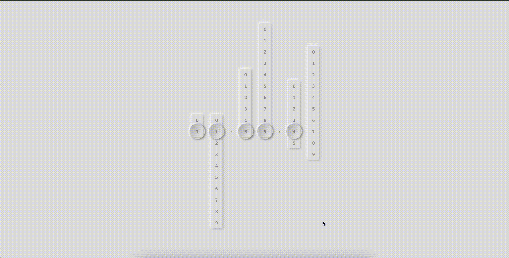
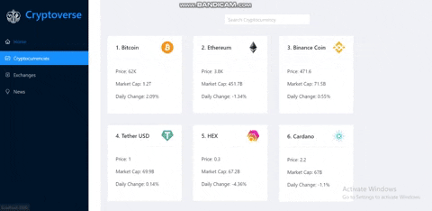

<h1 align="center">Hi 👋, I'm Izhar</h1>
<h3 align="center">A passionate React JS and Node JS developer from Pakistan</h3>

  

- 🔭 I’m currently working on [Next JS Blog](https://github.com/izhar360/BadBingFrontEnd)

- 👯 I’m looking to collaborate on [MERN Stack Project](https://github.com/izhar360/FinalYearProjects)

- 👷 I'm available for freelance, contract based and full time Job.

- 📃 Check out My [CV](CV_2021-10-19_Muhammad_Izhar.pdf)

- 📫 How to reach me **Muhammadizhar360@gmail.com**

<h3 align="left">Connect with me:</h3>

<h3 align="left">Languages and Tools:</h3>

                   

<h3 align="left">Recent Projects:</h3>

Arc Development Project With React JS | Material UI:

Neo Digital Clock With React JS | TypeScript:

MacOS finder with React JS | SASS:

https://user-images.githubusercontent.com/79567009/138412822-6dbcb9bf-9eae-4f35-82eb-859fda983286.mp4

Cryptoverse Project With React JS | Ant Design:

Blog with MERN Stack | Next JS | Material UI:

&nbsp;

